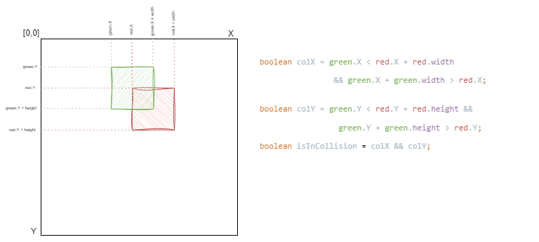

## Java FX 2D Graphics Continue - Collisions and textures

* Add textures to the previous example.
* add several other objects to the canvas.
* Implement collisions.
* implement fight mechanism where score of booth characters will be compared and larger score wins. 
* If player wins this fight, generate new monster.

[2D collision detection](https://developer.mozilla.org/en-US/docs/Games/Techniques/2D_collision_detection)

